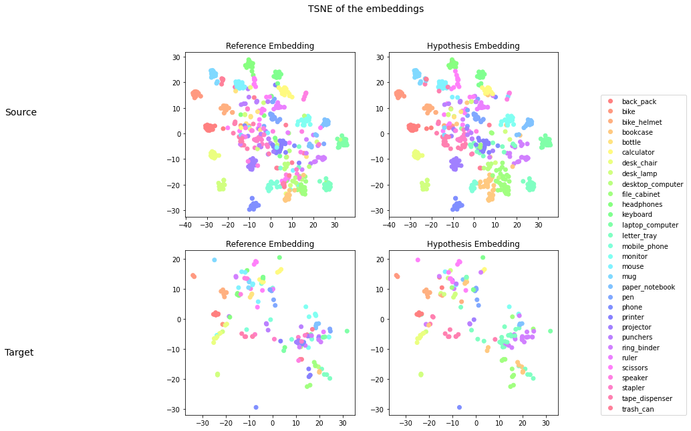
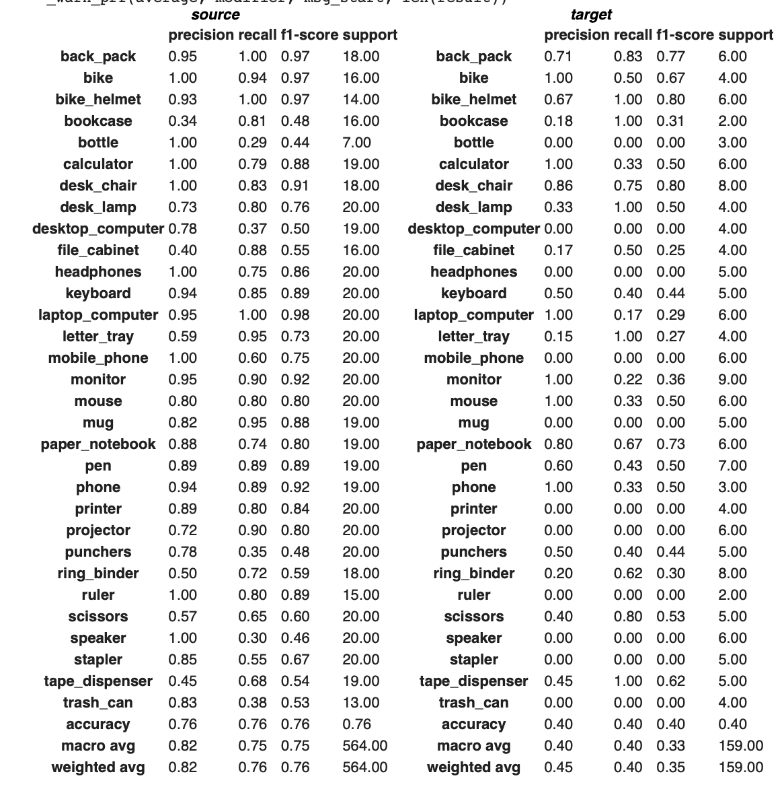

# FIRST BETA OF MAGICAL t-SNE plotter




thanks to:
* myself
*  [Simone Alghisi](https://github.com/Simone-Alghisi/Simone-Alghisi)
*  [Giovanni Ambrosi]()
*  [Filippo Daniotti]()
for inspiration and extensive testing

```
def eval_plot_source_target(model: nn.Module,
                            source_loader: Iterable,
                            target_loader: Iterable,
                            class_mapping: Dict[str,int],
                            device: str ='cpu',callback_fn=None, colormap:Dict[int,Tuple[int,int,int]] = None) -> None:
```


* Model : Almost any torch end-to-end model. Requires the classification layer to be placed on the topmost level in a ```nn.Sequential``` module. Example of valid model
```
  Sequential(
  (0): Extractor(
    (model): Sequential(
      (0): Conv2d(3, 64, kernel_size=(7, 7), stride=(2, 2), padding=(3, 3), bias=False)
      (1): BatchNorm2d(64, eps=1e-05, momentum=0.1, affine=True, track_running_stats=True)
      (2): ReLU(inplace=True)
      (3): MaxPool2d(kernel_size=3, stride=2, padding=1, dilation=1, ceil_mode=False)
      (4): Sequential(
        (0): BasicBlock(
          (conv1): Conv2d(64, 64, kernel_size=(3, 3), stride=(1, 1), padding=(1, 1), bias=False)
          (bn1): BatchNorm2d(64, eps=1e-05, momentum=0.1, affine=True, track_running_stats=True)
          (relu): ReLU(inplace=True)
          (conv2): Conv2d(64, 64, kernel_size=(3, 3), stride=(1, 1), padding=(1, 1), bias=False)
          (bn2): BatchNorm2d(64, eps=1e-05, momentum=0.1, affine=True, track_running_stats=True)
        )
      )
      (5): AdaptiveAvgPool2d(output_size=(1, 1))
    )
  )
  (1): Classifier(
    (identity): Identity()
    (fc): Linear(in_features=512, out_features=31, bias=True)
  )
)
```
Example of invalid model
```
  Sequential(
  (0): Extractor(
    (model): Sequential(
      (0): Conv2d(3, 64, kernel_size=(7, 7), stride=(2, 2), padding=(3, 3), bias=False)
      (1): BatchNorm2d(64, eps=1e-05, momentum=0.1, affine=True, track_running_stats=True)
      (2): ReLU(inplace=True)
      (3): MaxPool2d(kernel_size=3, stride=2, padding=1, dilation=1, ceil_mode=False)
      (4): Sequential(
        (0): BasicBlock(
          (conv1): Conv2d(64, 64, kernel_size=(3, 3), stride=(1, 1), padding=(1, 1), bias=False)
          (bn1): BatchNorm2d(64, eps=1e-05, momentum=0.1, affine=True, track_running_stats=True)
          (relu): ReLU(inplace=True)
          (conv2): Conv2d(64, 64, kernel_size=(3, 3), stride=(1, 1), padding=(1, 1), bias=False)
          (bn2): BatchNorm2d(64, eps=1e-05, momentum=0.1, affine=True, track_running_stats=True)
        )
      )
      (4): AdaptiveAvgPool2d(output_size=(1, 1))
      (5): Classifier(
        (identity): Identity()
        (fc): Linear(in_features=512, out_features=31, bias=True)
      ) 
    )
  )

)
```

* source_loader : Source dataloader. Expects a simple loader of which each element is ```Tuple(input,output)``` and ```input``` of a shape ```[batch_size,any]```. ```output``` should be ```[batch_size,]```
* target_loader : Target dataloader. Expects a simple loader of which each element is ```Tuple(input,output)``` and ```input``` of a shape ```[batch_size,any]```. ```output``` should be ```[batch_size,]```
* class_mapping : a Dictionary that contains ```{'back_pack':0,'purse':1...}``` for each ```string``` that represents the class, it's corresponding ```int``` in the dataloader
* device : where to execute the code. Default on ```cpu```
* callback_fn: **REQUIRED!** a function to map the output of your model to a standard ```[batch_size,]``` where each item correspond to the prediction for that sample. Example of function that maps a non-argmaxed  ```[batch_size,num_classes]```result to a argmaxed ```[batch_size,]```result
```
def callback_sample(input:Tensor) -> Tensor:
    output = torch.argmax(input,axis=1)
    return output
```
* colormap : dictionary of ```Dict[int,Tuple[int,int,int]]``` where for each ```int``` that represent each class is provided a HEX color. Optional. If not given a **perfect** rainbow will be generated
